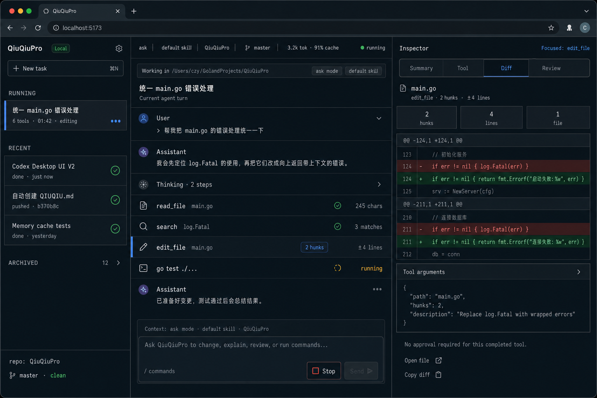

# QiuQiuPro Codex Desktop 风格 Web UI 规格（V1）

## 概述

第一版 UI 为本地 Web App：Go 进程启动 HTTP + SSE 事件流，浏览器展示会话、执行过程、工具结果和 diff。
设计方向对标 Codex Desktop App，而不是纯终端 TUI：它应该像一个轻量桌面开发工具，有会话管理、任务线程、右侧详情面板和明确的审批入口。

核心目标：

- 管理多个历史会话和后续的并行任务
- 实时展示 Agent 的执行过程
- 将 diff、工具结果、审批动作作为一等视图
- 保留现有 CLI 行为，不加 `--web` 时不改变终端交互

## 设计预览



---

## 页面布局

```
┌──────────────┬────────────────────────────────┬──────────────────────┐
│ Sidebar      │ Thread                         │ Inspector            │
│              │                                │                      │
│ QiuQiuPro    │ Top Bar                        │ 当前选中的详情        │
│ + 新会话      │ mode · skill · session · usage │                      │
│              ├────────────────────────────────┤ Diff / Tool / Review  │
│ 今天          │                                │                      │
│  ● 会话 A     │  > 用户输入                    │ 文件路径              │
│    会话 B     │                                │ hunks 摘要            │
│ 昨天          │  Assistant 流式回复            │ 红绿 diff             │
│    会话 C     │  Thinking 折叠块               │                      │
│              │  Tool row: read_file ✓         │ [Approve] [Reject]   │
│              │  Tool row: edit_file 2 hunks   │                      │
│              │                                │                      │
│              ├────────────────────────────────┤                      │
│              │ Composer                       │                      │
│              │ > 输入消息 / slash command      │                      │
└──────────────┴────────────────────────────────┴──────────────────────┘
```

---

## 视觉风格

- 整体像桌面开发工具，不像聊天产品：低饱和深色背景、细边框、紧凑排版、无大面积圆角卡片。
- 字体使用系统 UI 字体，代码、工具名、diff、路径使用等宽字体。
- 主线程不使用左右气泡；每条消息是 timeline row，按角色、状态和工具类型区分。
- 高亮颜色只用于状态：绿色表示完成，蓝色表示运行中，黄色表示等待确认，红色表示错误或删除行。
- 右侧 Inspector 是主要工作区之一，不是附属弹窗；用户查看 diff、审批工具、检查工具结果都在这里完成。
- V1 支持深色 / 浅色主题切换，默认跟随系统主题。

### 主题切换

- 提供 `Auto / Dark / Light` 三种主题选项。
- `Auto` 使用浏览器的 `prefers-color-scheme`。
- 用户手动选择的主题保存在浏览器 `localStorage`，不写入项目配置。
- 主题入口放在左侧边栏底部或顶部状态栏右侧，避免占用 Thread 主区域。
- 深色和浅色主题共享同一套布局、间距和组件状态，只替换 CSS 变量。
- diff、状态色和焦点态必须同时适配深浅主题，确保红绿 diff 在浅色背景下仍然可读。

## 左侧边栏：历史会话

- 按日期分组展示（今天 / 昨天 / 更早）
- 每条显示会话摘要（第一条用户输入的前 30 字）
- 当前活跃会话使用左侧强调线或圆点标记
- 正在运行的会话显示运行状态，后续可支持多个后台任务
- 点击切换到该历史会话；如果该会话正在运行，继续接收它的事件流
- 顶部或底部提供"新会话"按钮，开启全新 session
- 数据来源：`.reasonix/sessions/` 下的 checkpoint 文件

### 会话切换 API

| Method | Path | 说明 |
|--------|------|------|
| GET | `/api/sessions` | 列出所有历史会话（id, 摘要, 时间） |
| POST | `/api/sessions/switch` | 切换到指定会话 `{session_id}` |
| POST | `/api/sessions/new` | 新建会话 |

---

## Status Bar

| 字段 | 来源 |
|------|------|
| mode | `Agent.CurrentMode()` |
| skill | `Agent.CurrentSkillName()` |
| session | `Agent.SessionID()` |
| tokens | `Agent.Usage()` |
| cache rate | `Agent.SessionCacheStats()` |
| running | Agent 是否正在执行 Run |

---

## Thread 主区域

Thread 是中间主区域，展示当前 session 的线性执行过程。它不是聊天气泡，而是类似 Codex Desktop 的工作线程。

| 事件类型 | 渲染 |
|---------|------|
| `user_message` | `>` 前缀的用户输入 row |
| `assistant_delta` | assistant row，流式追加 Markdown |
| `reasoning_delta` | 灰色 thinking row，默认折叠，可展开 |
| `tool_call` | tool row：图标、工具名、状态、简短参数 |
| `tool_result` | tool row 更新为完成/失败，显示摘要 |
| `tool_diff` | Thread 中显示 diff 摘要，完整内容打开右侧 Inspector |
| `notice` | 低优先级状态提示 |
| `error` | 红色错误 row |
| `usage` | 轮次结束后的用量摘要 |

Thread row 的点击行为：

- 点击 assistant row：右侧 Inspector 显示完整 Markdown 文本
- 点击 reasoning row：展开/折叠 thinking 内容
- 点击 tool row：右侧 Inspector 显示工具参数、结果、耗时、错误
- 点击 diff row：右侧 Inspector 显示完整 diff

---

## Inspector 右侧详情面板

Inspector 展示当前选中对象的完整详情。V1 需要支持三类详情：

1. 工具详情：工具名、参数、结果、耗时、错误、是否截断
2. Diff 详情：文件路径、hunks、红绿 diff、变更统计
3. 确认详情：高危工具说明、参数预览、Approve / Reject 操作

Inspector 在窄屏下可以变成抽屉式面板；桌面宽屏默认常驻右侧。

### Diff 展示

当 `edit_file` / `multi_edit` / `delete_range` / `delete_symbol` 执行成功时：

- Thread 中显示"文件路径 + hunks 数 + ±N 行"摘要
- Inspector 中渲染完整 unified diff 红绿对比
- 删除行红色背景，新增行绿色背景，context 行使用弱色文本
- diff 默认按文件分组；单文件时直接展示 hunks
- diff 数据由后端在工具执行后生成，随 `tool_result` 事件的 `diff` 字段下发

---

## Composer 输入区

- 底部固定输入区，支持多行输入
- Enter 发送，Shift+Enter 换行
- `/` 开头触发命令补全
- 执行中显示"停止"按钮（调用 `Agent.Interrupt()`）
- 非执行中显示"发送"按钮
- 高危工具需确认时，Composer 旁显示等待状态，具体确认内容在 Inspector 中展示
- 后续可支持附件、截图、文件引用

---

## SSE 事件合约

UI 通过 `/api/events` SSE 端点接收 Agent 运行过程的结构化事件。

### 事件格式

```
event: <type>
data: <JSON payload>
```

### 事件类型定义

| event type | payload | 说明 |
|-----------|---------|------|
| `state` | `{mode, skill, session_id, running}` | 连接时和状态变化时推送 |
| `user_message` | `{text}` | 用户输入回显 |
| `assistant_delta` | `{text}` | assistant 流式增量 |
| `reasoning_delta` | `{text}` | 思考链增量 |
| `tool_call` | `{id, name, arguments}` | 工具开始执行 |
| `tool_result` | `{id, name, result, diff, truncated}` | 工具执行完成，写工具附带 diff |
| `assistant_done` | `{text}` | 本轮 assistant 最终完整文本 |
| `notice` | `{text}` | 流程/状态提示 |
| `error` | `{text}` | 错误 |
| `usage` | `{prompt, cached, completion, reasoning, total, hit_rate}` | 轮次用量 |
| `confirm_request` | `{tool_name, arguments, reason}` | 需要用户确认 |
| `done` | `{}` | 本轮结束 |
| `session_updated` | `{session_id, title, updated_at, running}` | 会话列表刷新 |
| `selection_hint` | `{kind, id}` | UI 可自动选中最新工具或 diff |

### diff 字段格式

`tool_result` 事件中，写工具成功时附带 `diff` 字段：

```json
{
  "id": "call_xxx",
  "name": "edit_file",
  "result": "文件已修改",
  "diff": {
    "path": "agent/sink.go",
    "hunks": [
      {
        "old_start": 12,
        "new_start": 12,
        "lines": [
          {"op": "ctx", "text": "const ("},
          {"op": "del", "text": "\tEventToken EventKind = iota"},
          {"op": "add", "text": "\tEventToken      EventKind = iota"},
          {"op": "ctx", "text": ")"}
        ]
      }
    ]
  }
}
```

---

## HTTP API

| Method | Path | 说明 |
|--------|------|------|
| GET | `/api/events` | SSE 事件流 |
| POST | `/api/send` | 发送用户输入 `{text}` |
| POST | `/api/interrupt` | 中断当前执行 |
| POST | `/api/confirm` | 确认高危工具 `{approve: bool}` |
| GET | `/api/state` | 查询当前状态快照 |
| GET | `/api/history` | 获取当前会话历史消息 |
| GET | `/api/tools` | 获取可用工具列表 |
| GET | `/api/sessions` | 列出所有历史会话 |
| POST | `/api/sessions/switch` | 切换会话 `{session_id}` |
| POST | `/api/sessions/new` | 新建会话 |
| GET | `/api/sessions/{id}/history` | 获取指定历史会话消息 |

---

## 控制动作

| 动作 | 触发 | Agent 方法 |
|------|------|-----------|
| 发送消息 | POST /api/send | `Agent.Run(ctx, input)` |
| 中断 | POST /api/interrupt | `Agent.Interrupt()` |
| 确认工具 | POST /api/confirm | 通过 channel 通知 Gate |
| 切换模式 | POST /api/send `/mode plan` | 命令分发 |
| 切换会话 | POST /api/sessions/switch | 加载 checkpoint |
| 新建会话 | POST /api/sessions/new | 重置 Agent session |

---

## 第一版验收标准

1. `go build` 产出单个二进制，加 `--web` 启动本地 HTTP 服务
2. 浏览器打开后能看到左侧会话列表 + 中间 Thread + 顶部状态栏 + 右侧 Inspector + 底部 Composer
3. 发送消息后 Thread 实时展示 reasoning、assistant 文本、工具调用
4. 点击工具 row 后 Inspector 显示工具参数和结果
5. edit_file 等写工具结果在 Thread 中显示摘要，在 Inspector 中显示完整 diff 红绿对比
6. "停止"按钮能中断正在执行的任务
7. Status Bar 实时反映 mode、skill、usage、running 状态
8. 左侧边栏展示历史会话，支持切换和新建
9. 不改变现有 CLI 行为（不加 `--web` 时仍是终端交互）
10. 高危工具在 Inspector 中展示确认详情，并支持 Approve / Reject
11. `/compact`、`/usage`、`/memory` 等命令仍可通过输入框使用
12. UI 支持 `Auto / Dark / Light` 主题切换，刷新页面后保留用户选择

---

## 技术选型

- 后端：Go net/http + SSE（不需要 WebSocket）
- 前端：单个 HTML 文件，内嵌 CSS + JS（用 go:embed 打包）
- 不引入前端构建工具，保持零依赖
- 主题：CSS custom properties 定义颜色 token，`localStorage` 保存用户主题偏好
- Diff 渲染：前端根据 hunks 数据渲染红绿行，不依赖外部 diff 库
- 高危确认通过 `confirm_request` 事件 + `/api/confirm` 回传实现
- 会话持久化复用现有 `.reasonix/sessions/` checkpoint 机制

---

## V1 非目标

- 不做真正的多 Agent 并行执行；只在视觉和数据结构上预留 running session 状态
- 不做复杂前端工程化；暂不引入 React/Vite/Tailwind
- 不做完整 Git 客户端；diff 只展示 Agent 写工具产生的变更
- 不做远程访问和鉴权；V1 只面向本机浏览器
